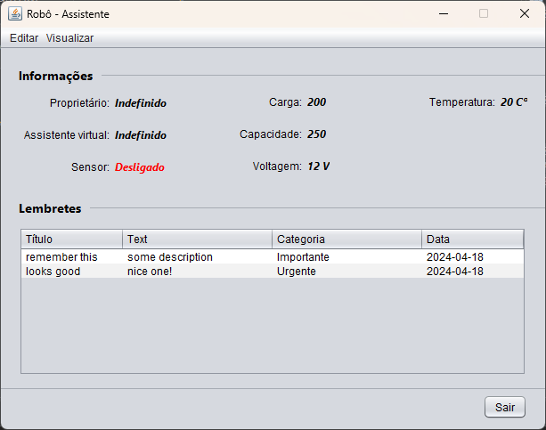
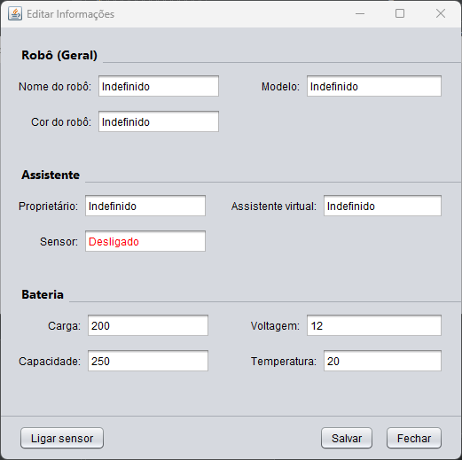
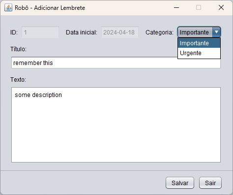
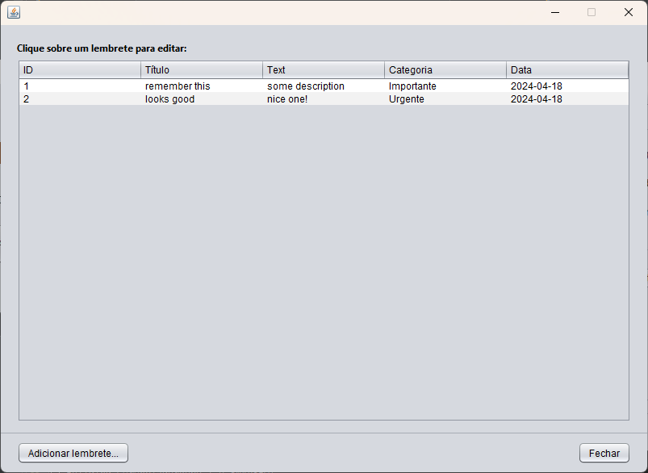
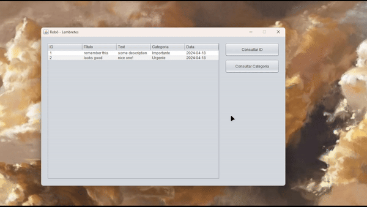

# Assistant 🤖
The **assistant robot** stores its operational information such as: Owner, virtual assistant, sensor, and also details from its battery: Charge, capacity, voltage, temperature.

## Main Menu
In this menu, the robot’s information is displayed, along with a condensed version of its list of registered reminders. The other screens can be accessed from here via the top menu.

## Editing Infos.
In this window, you can edit the robot’s information, and there is also a button to turn its sensor on or off. All inputs in this window are validated to prevent `type errors`.

## Adding reminders
All added reminders are displayed in the reminder list.
### Adding menu

In this window, you can add a title to the reminder as well as its description and assign a category to the reminder

After completing the addition, the new reminder can be seen in the list:

### Editing
Clicking on a reminder in the list opens an edit screen similar to the creation screen. On this screen, the reminder can also be deleted!

## Filtering Reminder
There is a dedicated viewing window for reminders where you can filter by both ID and Category.

