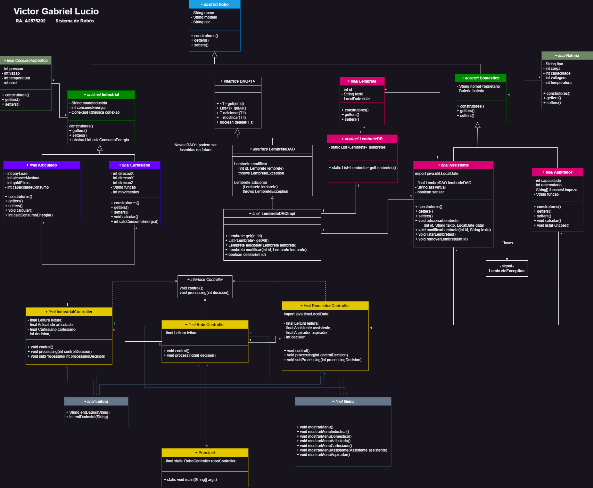

# Gerenciador Robô
The project was developed to put into practice the concepts of **Object-Oriented Programming (OOP)**. For this project, it was requested `not to use any packages.` 

## Project Diagram 🗃️
During the project implementation, it was requested to remove two robots to streamline the project. This is the initial diagram:

## Robôs 🤖
**Domestic robot** that stores operational information and manages a list of reminders.
- [Assistent](Assistant.md)

Gerenciador de robôs articulados
- [Articulated]()
